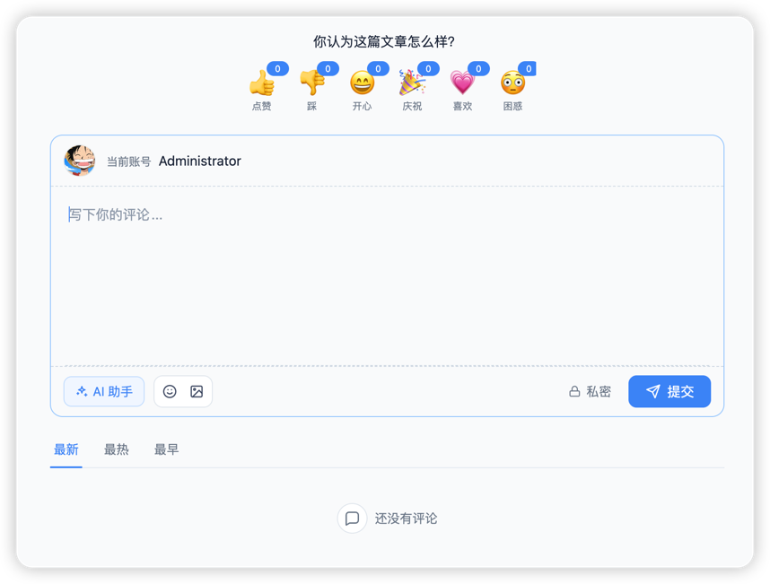

# 评论组件 Next

评论组件 Next 是为 Halo 打造的下一代评论系统，提供更现代的评论框、评论列表、互动能力和后台管理能力。它不仅支持富文本评论、图片上传、表情包、私密评论、评论精选/置顶、举报、黑灰名单、验证码和徽章体系，也可以结合 Halo AI Foundation 提供 AI 写作、@AI 自动回复、AI 自动回复管理和 AI 恶意评论拦截。

UI 部分基于 Svelte Web Component 构建，由插件自动注入到 Halo 主题的评论位中使用。



## 功能特性

- 富文本评论框：支持图片上传、表情包、私密评论、移动端适配和主题 CSS 变量定制。
- 评论互动增强：支持文章表情回应、评论/回复表情回应、评论精选、评论置顶、用户徽章和评论举报。
- 图片上传：支持 Halo 附件库和 ImgBB，可分别配置登录用户与未登录用户的上传方式、大小限制和安全拦截。
- 验证码：支持图片验证码、GeeTest、ALTCHA 和 Cap，统一在提交评论时弹出验证。
- 安全管理：支持 IP、邮箱、用户名、关键词、域名、UA 的黑名单/灰名单规则，支持精确、包含和正则匹配。
- AI 能力：支持 AI 写作助手、@AI 自动回复、AI 自动回复候选审核、AI 恶意评论识别和拦截通知。
- 后台管理：提供评论表情、举报记录、AI 回复管理、AI 拦截记录、黑灰名单、徽章设置等控制台菜单。

## 配置概览

插件安装后，可在插件设置中按模块配置：

- 基本设置：评论分页、回复分页、回复预加载、评论者设备信息、私密评论。
- 图片上传：支持 Halo 附件库和 ImgBB，可分别设置登录用户与未登录用户的上传方式、大小限制和上传限流。
- 验证码：支持字母数字、算术验证码、GeeTest、ALTCHA 和 Cap，统一在提交评论时弹出验证。
- 表情回应：支持文章、评论、回复的表情回应，并可分别配置 emoji 或图片回应项。
- 举报设置：支持评论和回复举报，可设置达到举报阈值后自动进入待审核。
- AI 助手：支持 AI 写作助手、@AI 自动回复、AI 自动回复管理、AI 提示词配置和 AI 恶意评论识别。
- 徽章设置：支持首评徽章、管理员徽章、自定义徽章规则和用户徽章展示。

## 可选依赖

- AI 相关功能依赖 [Halo AI Foundation](https://www.halo.run/store/apps/app-acslk9nu)。未安装或未启用时，普通评论、上传、验证码、举报、黑灰名单等功能不受影响。
- GeeTest、Cap、ImgBB 需要站长自行准备对应服务或密钥。
- Halo 附件库上传需要在插件设置中选择存储策略和存储组。

## 使用方式

1. 下载：访问 [Releases](https://github.com/acanyo/plugin-comment-next/releases) 下载 Assets 中的 JAR 文件。
2. 安装，插件安装和更新方式可参考：<https://docs.halo.run/user-guide/plugins>。

> 需要注意的是，此插件需要主题进行适配，不会主动在内容页加载评论组件。

## 后台菜单

插件会在 Halo 控制台的评论菜单下增加以下管理入口：

- 评论徽章
- 评论表情
- 精选评论
- AI 拦截记录
- 举报记录
- AI 回复管理
- 黑灰名单

## 开发环境

```bash
git clone git@github.com:acanyo/plugin-comment-next.git

# 或者当你 fork 之后

git clone git@github.com:{your_github_id}/plugin-comment-next.git
```

```bash
cd path/to/plugin-comment-next
```

```bash
./gradlew pnpmInstall

# 启动一个 Docker 容器作为开发环境并自动加载此插件
./gradlew haloServer
```

Halo 插件的详细开发文档可查阅 [插件开发](https://docs.halo.run/category/%E6%8F%92%E4%BB%B6%E5%BC%80%E5%8F%91)。

## 主题适配

### 接入

评论组件 Next 实现的是 Halo 的 `comment-widget` 扩展点。启用插件后，插件会自动向主题页面注入 `comment-next.css` 和 `comment-next.iife.js`，主题只需要在文章页、独立页面的评论位置渲染 Halo 评论标签。

插件自己的前台标签是 `<comment-widget>`，但它由 Halo 的 `<halo:comment />` 扩展点自动渲染出来。常规主题适配时推荐写 `<halo:comment />`，这样可以继续遵循 Halo 的评论启用状态、内容类型和插件扩展点机制。

文章页示例：

```html
<div th:if="${haloCommentEnabled}">
  <halo:comment
    group="content.halo.run"
    kind="Post"
    th:attr="name=${post.metadata.name}"
  />
</div>
```

独立页面示例：

```html
<div th:if="${haloCommentEnabled}">
  <halo:comment
    group="content.halo.run"
    kind="SinglePage"
    th:attr="name=${singlePage.metadata.name}"
  />
</div>
```

如果主题没有渲染 `<halo:comment />`，评论组件不会出现在内容页。更多标签说明可参考 Halo 官方文档：[自定义标签](https://docs.halo.run/developer-guide/theme/template-tag#halocomment)。

### 自定义样式

评论组件 Next 会优先读取 `--halo-cw-*` 变量，这套变量和 Halo 评论组件常用主题变量保持一致。主题如果已经定义了这些变量，评论组件会自动继承；如果需要进一步定制，也可以在主题 CSS 中覆盖这些变量。

建议优先使用以下稳定变量：

| 变量名                       | 描述                                     |
| ---------------------------- | ---------------------------------------- |
| `--halo-cw-primary-1-color`  | 主要的主题色，用于按钮背景，输入框边框等 |
| `--halo-cw-primary-2-color`  | 较浅的主题色                             |
| `--halo-cw-primary-3-color`  | 最浅的主题色                             |
| `--halo-cw-text-1-color`     | 主要文本颜色，用于标题、正文等           |
| `--halo-cw-text-2-color`     | 次要文本颜色                             |
| `--halo-cw-text-3-color`     | 辅助文本颜色                             |
| `--halo-cw-muted-1-color`    | 弱化色，用于边框、分割线、背景等辅助元素 |
| `--halo-cw-muted-2-color`    | 更浅的弱化色                             |
| `--halo-cw-muted-3-color`    | 最浅的弱化色                             |
| `--halo-cw-base-rounded`     | 基础圆角大小                             |
| `--halo-cw-avatar-rounded`   | 头像圆角大小                             |
| `--halo-cw-avatar-size`      | 头像尺寸                                 |
| `--halo-cw-base-font-size`   | 基础字体大小                             |
| `--halo-cw-base-font-family` | 基础字体族                               |

示例：

```css
:root {
  --halo-cw-primary-1-color: #2563eb;
  --halo-cw-primary-2-color: #bfdbfe;
  --halo-cw-primary-3-color: #eff6ff;

  --halo-cw-text-1-color: #172033;
  --halo-cw-text-2-color: #64748b;
  --halo-cw-text-3-color: #94a3b8;

  --halo-cw-muted-1-color: #d5dde7;
  --halo-cw-muted-2-color: #e7ecf2;
  --halo-cw-muted-3-color: #ffffff;

  --halo-cw-base-rounded: 0.875rem;
  --halo-cw-avatar-rounded: 9999px;
  --halo-cw-avatar-size: 36px;
  --halo-cw-base-font-size: 1rem;
  --halo-cw-base-font-family: ui-sans-serif, system-ui, -apple-system, BlinkMacSystemFont, "Segoe UI", sans-serif;
}
```

<details>
<summary>更细粒度的变量</summary>

如果主题需要精细控制评论框、弹层、徽章、AI 面板、精选/置顶标识等细节，可以继续覆盖 `--comment-next-*` 变量。此类变量更贴近组件内部实现，后续版本可能会调整，主题适配时优先使用 `--halo-cw-*`。

```css
:root {
  --comment-next-bg-color: #ffffff;
  --comment-next-text-color: #172033;
  --comment-next-muted-color: #64748b;
  --comment-next-border-color: #d5dde7;
  --comment-next-radius-lg: 0.875rem;
  --comment-next-reaction-hover-bg-color: rgb(239 246 255 / 0.68);
  --comment-next-pinned-pill-bg-color: #fef3c7;
  --comment-next-featured-pill-bg-color: #ccfbf1;
}
```

</details>

<details>
<summary>旧变量迁移</summary>

评论组件 Next 不建议继续使用 `--halo-comment-widget-*` 这类旧变量。主题侧如果仍然保留旧变量，建议迁移到 `--halo-cw-*`。

| 变量名                                                                  | 描述                     | 备注                                               |
| ----------------------------------------------------------------------- | ------------------------ | -------------------------------------------------- |
| `--halo-comment-widget-base-color`                                      | 基础文字颜色             | 已废弃，后续使用 `--halo-cw-text-1-color` 代替     |
| `--halo-comment-widget-base-info-color`                                 | 非重要突出文字           | 已废弃，后续使用 `--halo-cw-muted-*-color` 代替    |
| `--halo-comment-widget-base-border-radius`                              | 基础元素的圆角           | 已废弃，后续使用 `--halo-cw-base-rounded` 代替     |
| `--halo-comment-widget-base-font-size`                                  | 基础字体大小             | 已废弃，后续使用 `--halo-cw-base-font-size` 代替   |
| `--halo-comment-widget-base-line-height`                                | 基础行高                 | 已废弃                                             |
| `--halo-comment-widget-base-font-family`                                | 基础字体族               | 已废弃，后续使用 `--halo-cw-base-font-family` 代替 |
| `--halo-comment-widget-component-avatar-rounded`                        | 头像的圆角大小           | 已废弃，后续使用 `--halo-cw-avatar-rounded` 代替   |
| `--halo-comment-widget-component-avatar-size`                           | 头像大小                 | 已废弃，后续使用 `--halo-cw-avatar-size` 代替      |
| `--halo-comment-widget-component-form-input-bg-color`                   | 表单输入背景颜色         | 已废弃                                             |
| `--halo-comment-widget-component-form-input-color`                      | 表单输入文字颜色         | 已废弃                                             |
| `--halo-comment-widget-component-form-input-border-color`               | 表单输入边框颜色         | 已废弃                                             |
| `--halo-comment-widget-component-form-input-border-color-focus`         | 表单输入焦点时边框颜色   | 已废弃，后续使用 `--halo-cw-primary-1-color` 代替  |
| `--halo-comment-widget-component-form-input-box-shadow-focus`           | 表单输入焦点时的阴影     | 已废弃，后续使用 `--halo-cw-primary-2-color` 代替  |
| `--halo-comment-widget-component-form-button-login-bg-color`            | 登录按钮背景颜色         | 已废弃                                             |
| `--halo-comment-widget-component-form-button-login-bg-color-hover`      | 登录按钮悬停背景颜色     | 已废弃                                             |
| `--halo-comment-widget-component-form-button-login-border-color`        | 登录按钮边框颜色         | 已废弃                                             |
| `--halo-comment-widget-component-form-button-submit-bg-color`           | 提交按钮背景颜色         | 已废弃，后续使用 `--halo-cw-primary-1-color` 代替  |
| `--halo-comment-widget-component-form-button-submit-color`              | 提交按钮文字颜色         | 已废弃                                             |
| `--halo-comment-widget-component-form-button-submit-border-color`       | 提交按钮边框颜色         | 已废弃                                             |
| `--halo-comment-widget-component-form-button-submit-border-color-hover` | 提交按钮悬停边框颜色     | 已废弃，后续使用 `--halo-cw-primary-3-color` 代替  |
| `--halo-comment-widget-component-form-button-emoji-color`               | 表情按钮颜色             | 已废弃                                             |
| `--halo-comment-widget-component-comment-item-action-bg-color-hover`    | 评论项操作悬停背景颜色   | 已废弃                                             |
| `--halo-comment-widget-component-comment-item-action-color-hover`       | 评论项操作悬停颜色       | 已废弃                                             |
| `--halo-comment-widget-component-pagination-button-bg-color-hover`      | 分页按钮悬停背景颜色     | 已废弃                                             |
| `--halo-comment-widget-component-pagination-button-bg-color-active`     | 分页按钮活动状态背景颜色 | 已废弃                                             |
| `--halo-comment-widget-component-pagination-button-border-color-active` | 分页按钮活动状态边框颜色 | 已废弃                                             |
| `--halo-comment-widget-component-emoji-picker-rgb-color`                | 表情选择器颜色           | 已废弃                                             |
| `--halo-comment-widget-component-emoji-picker-rgb-accent`               | 表情选择器强调颜色       | 已废弃                                             |
| `--halo-comment-widget-component-emoji-picker-rgb-background`           | 表情选择器背景颜色       | 已废弃                                             |
| `--halo-comment-widget-component-emoji-picker-rgb-input`                | 表情选择器输入颜色       | 已废弃                                             |
| `--halo-comment-widget-component-emoji-picker-color-border`             | 表情选择器边框颜色       | 已废弃                                             |
| `--halo-comment-widget-component-emoji-picker-color-border-over`        | 表情选择器悬停边框颜色   | 已废弃                                             |

</details>

### 配色切换方案

评论组件 Next 内置了明亮、深色和跟随系统三种模式。主题只需要在 `html` 或 `body` 上添加 class 或 `data-color-scheme`，组件会自动切换对应配色。

可用 class：

- `color-scheme-auto`：跟随系统。
- `color-scheme-dark` / `dark`：强制深色。
- `color-scheme-light` / `light`：强制明亮。

可用 `data-color-scheme`：

- `data-color-scheme="auto"`：跟随系统。
- `data-color-scheme="dark"`：强制深色。
- `data-color-scheme="light"`：强制明亮。

示例：

```css
@media (prefers-color-scheme: dark) {
  .color-scheme-auto,
  [data-color-scheme="auto"] {
    color-scheme: dark;

    --halo-cw-primary-1-color: #93c5fd;
    --halo-cw-primary-2-color: #60a5fa;
    --halo-cw-primary-3-color: #1e3a8a;

    --halo-cw-text-1-color: #f4f4f5;
    --halo-cw-text-2-color: #a1a1aa;
    --halo-cw-text-3-color: #71717a;

    --halo-cw-muted-1-color: #52525b;
    --halo-cw-muted-2-color: #3f3f46;
    --halo-cw-muted-3-color: #18181b;
  }
}

.color-scheme-dark,
.dark,
[data-color-scheme="dark"] {
  color-scheme: dark;

  --halo-cw-primary-1-color: #93c5fd;
  --halo-cw-primary-2-color: #60a5fa;
  --halo-cw-primary-3-color: #1e3a8a;

  --halo-cw-text-1-color: #f4f4f5;
  --halo-cw-text-2-color: #a1a1aa;
  --halo-cw-text-3-color: #71717a;

  --halo-cw-muted-1-color: #52525b;
  --halo-cw-muted-2-color: #3f3f46;
  --halo-cw-muted-3-color: #18181b;
}
```

## 注意事项

- 当前推荐接入方式是 Halo 插件 + 主题 `<halo:comment />` 标签，不再在 README 中提供独立 npm 组件接入说明。
- AI 写作、@AI 自动回复、AI 自动回复和 AI 拦截都需要先在 AI Foundation 中配置可用语言模型。
- 匿名上传、匿名 AI 和匿名举报会带来资源消耗风险，建议配合验证码、限流和审核策略开启。
- 如果评论组件没有显示，优先检查主题是否渲染了 `<halo:comment />`，以及当前内容是否允许评论。

## 开源协议

本项目基于 [GPL-3.0](./LICENSE) 协议开源。
